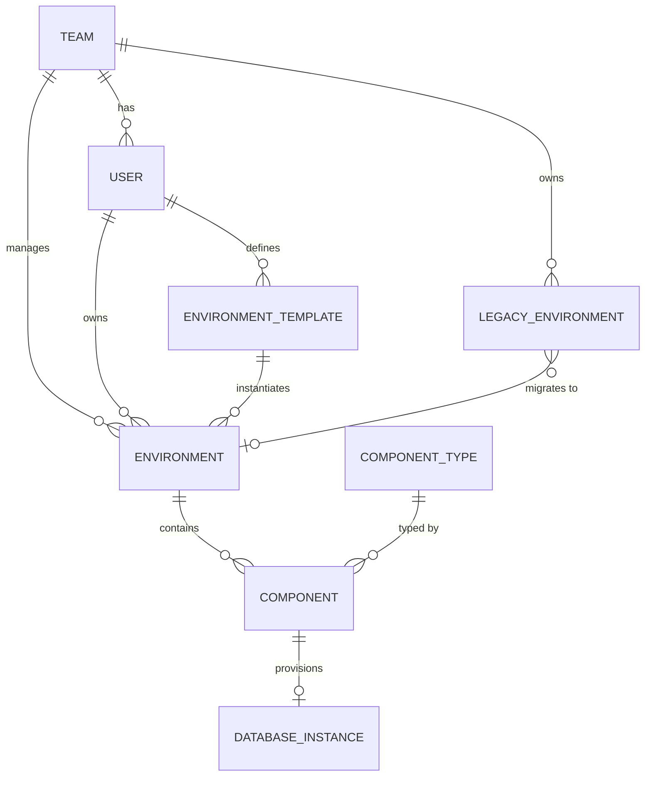

# Entity Model — IDP Test Environment Platform

**Version:** 1.0
**Date:** 2026-03-14
**Source:** [docs/requirements.md](requirements.md)

---

## Entity Relationship Diagram

---

### USER

Platform user who creates and manages test environments. Platform engineers are not scoped to a single team and have `team_id = null`.

| Attribute  | Description                            | Data Type | Length/Precision | Validation Rules                                              |
|------------|----------------------------------------|-----------|------------------|---------------------------------------------------------------|
| id         | Unique identifier                      | Long      | 19               | Primary Key, Sequence                                         |
| username   | Login name                             | String    | 100              | Not Null, Unique                                              |
| email      | User email address                     | String    | 255              | Not Null, Format: Email                                       |
| role       | Platform role                          | String    | 20               | Not Null, Values: developer, qa_engineer, team_lead, platform_engineer |
| team_id    | Team the user belongs to               | Long      | 19               | Optional, Foreign Key (TEAM.id)                               |
| created_at | Record creation timestamp              | DateTime  | -                | Not Null                                                      |

**Constraints:** `team_id` MUST be Not Null when `role` is `developer`, `qa_engineer`, or `team_lead`. `team_id` MUST be Null when `role` is `platform_engineer`.

---

### TEAM

Organisational unit that owns environments and tracks migration progress.

| Attribute         | Description                                    | Data Type | Length/Precision | Validation Rules      |
|-------------------|------------------------------------------------|-----------|------------------|-----------------------|
| id                | Unique identifier                              | Long      | 19               | Primary Key, Sequence |
| name              | Team name                                      | String    | 100              | Not Null, Unique      |
| created_at        | Record creation timestamp                      | DateTime  | -                | Not Null              |

**Note:** Migration progress counters (`total_legacy_envs`, `migrated_envs`) are NOT stored as columns. They are derived at query time by aggregating `LEGACY_ENVIRONMENT` records: `total = COUNT WHERE team_id=X`, `migrated = COUNT WHERE team_id=X AND migration_status IN ('validated','completed')`. This eliminates the two-source-of-truth inconsistency. (ref: MIN-004)

---

### ENVIRONMENT

A fully isolated test environment provisioned from a single YAML manifest.

| Attribute      | Description                                        | Data Type | Length/Precision | Validation Rules                                         |
|----------------|----------------------------------------------------|-----------|------------------|----------------------------------------------------------|
| id             | Unique identifier                                  | Long      | 19               | Primary Key, Sequence                                    |
| name           | Human-readable environment name                    | String    | 100              | Not Null                                                 |
| owner_id       | User who created the environment                   | Long      | 19               | Not Null, Foreign Key (USER.id)                          |
| team_id        | Team that manages this environment                 | Long      | 19               | Not Null, Foreign Key (TEAM.id)                          |
| namespace      | Dedicated Kubernetes namespace for this environment | String   | 63               | Not Null, Unique                                         |
| status         | Current reconciliation status                      | String    | 20               | Not Null, Values: Synced, Progressing, Degraded, Deleting |
| git_commit_sha | Git commit SHA of the last applied manifest        | String    | 40               | Optional                                                 |
| template_id    | Template this environment was created from         | Long      | 19               | Optional, Foreign Key (ENVIRONMENT_TEMPLATE.id)          |
| created_at     | Record creation timestamp                          | DateTime  | -                | Not Null                                                 |
| updated_at     | Record last update timestamp                       | DateTime  | -                | Not Null                                                 |

**Constraints:** `name` must be unique within the scope of a single `owner_id`.

---

### COMPONENT

An application component inside an environment, controlled by the `enabled` flag.

| Attribute        | Description                                          | Data Type | Length/Precision | Validation Rules                              |
|------------------|------------------------------------------------------|-----------|------------------|-----------------------------------------------|
| id               | Unique identifier                                    | Long      | 19               | Primary Key, Sequence                         |
| environment_id   | Environment this component belongs to                | Long      | 19               | Not Null, Foreign Key (ENVIRONMENT.id)        |
| component_type_id | Component type from the platform catalog            | Long      | 19               | Not Null, Foreign Key (COMPONENT_TYPE.id)     |
| name             | Component name within the environment                | String    | 100              | Not Null                                      |
| enabled          | Whether the component is provisioned (true) or removed (false) | Boolean | 1     | Not Null                                      |
| image_tag        | Override for the container image tag                 | String    | 128              | Optional                                      |
| replicas         | Override for the number of pod replicas              | Integer   | 10               | Optional, Min: 0, Max: 50                     |
| config_overrides | JSON map of additional configuration overrides       | String    | 4000             | Optional                                      |

**Constraints:** `name` must be unique within the scope of a single `environment_id`.

---

### COMPONENT_TYPE

Catalog entry defining a reusable, platform-managed application component type.

| Attribute        | Description                                         | Data Type | Length/Precision | Validation Rules      |
|------------------|-----------------------------------------------------|-----------|------------------|-----------------------|
| id               | Unique identifier                                   | Long      | 19               | Primary Key, Sequence |
| name             | Component type identifier used in environment YAML  | String    | 100              | Not Null, Unique      |
| description      | Human-readable description of the component         | String    | 500              | Optional              |
| default_image    | Default container image reference                   | String    | 255              | Not Null              |
| default_replicas | Default number of pod replicas                      | Integer   | 10               | Not Null, Min: 1, Max: 50 |
| supports_database | Whether this component type provisions a database  | Boolean   | 1                | Not Null              |

---

### DATABASE_INSTANCE

A managed database instance provisioned alongside an enabled component.

| Attribute       | Description                                  | Data Type | Length/Precision | Validation Rules                               |
|-----------------|----------------------------------------------|-----------|------------------|------------------------------------------------|
| id              | Unique identifier                            | Long      | 19               | Primary Key, Sequence                          |
| component_id    | Component this database belongs to           | Long      | 19               | Not Null, Foreign Key (COMPONENT.id)           |
| namespace       | Kubernetes namespace (copied from ENVIRONMENT) | String  | 63               | Not Null                                       |
| engine          | Database engine type                         | String    | 20               | Not Null, Values: postgresql, redis            |
| version         | Database engine version                      | String    | 20               | Not Null                                       |
| status          | Current provisioning status                  | String    | 20               | Not Null, Values: Provisioning, Ready, Terminating, Failed |
| connection_host | Internal cluster DNS hostname for connection | String    | 255              | Optional                                       |
| created_at      | Record creation timestamp                    | DateTime  | -                | Not Null                                       |

**Constraints:** `namespace` MUST equal `ENVIRONMENT.namespace` of the Environment that owns the parent Component. It is denormalised here to enable direct queries like "list all databases in namespace X" without joins.

---

### ENVIRONMENT_TEMPLATE

A reusable environment blueprint defined by a team lead for consistent provisioning.

| Attribute     | Description                                      | Data Type | Length/Precision | Validation Rules                       |
|---------------|--------------------------------------------------|-----------|------------------|----------------------------------------|
| id            | Unique identifier                                | Long      | 19               | Primary Key, Sequence                  |
| name          | Template name shown in the Backstage portal      | String    | 100              | Not Null, Unique                       |
| description   | Purpose and contents of this template            | String    | 500              | Optional                               |
| owner_id      | User who created and maintains this template     | Long      | 19               | Not Null, Foreign Key (USER.id)        |
| template_yaml | Parameterised environment YAML body              | String    | 65535            | Not Null                               |
| parameters    | JSON array of parameter definitions              | String    | 4000             | Optional                               |
| created_at    | Record creation timestamp                        | DateTime  | -                | Not Null                               |
| updated_at    | Record last update timestamp                     | DateTime  | -                | Not Null                               |

**Constraints:** `parameters` is a JSON array of objects with schema `{name: string, type: "string"|"integer"|"boolean", description: string, required: boolean, defaultValue: string|null}`. Each `name` must be unique within the array and must appear as a `${{ values.<name> }}` placeholder in `template_yaml`. If the owning user is deactivated, template ownership MUST be transferred to another `team_lead` from the same team or to a `platform_engineer` before deactivation is completed. (ref: MIN-006)

---

### LEGACY_ENVIRONMENT

A legacy docker-compose environment registered for migration to the new IDP platform.

| Attribute             | Description                                             | Data Type | Length/Precision | Validation Rules                                              |
|-----------------------|---------------------------------------------------------|-----------|------------------|---------------------------------------------------------------|
| id                    | Unique identifier                                       | Long      | 19               | Primary Key, Sequence                                         |
| team_id               | Team that owns this legacy environment                  | Long      | 19               | Not Null, Foreign Key (TEAM.id)                               |
| name                  | Environment name in the legacy platform                 | String    | 100              | Not Null                                                      |
| compose_file_path     | Path to the docker-compose file (may be unavailable)    | String    | 500              | Optional                                                      |
| migration_status      | Current migration state                                 | String    | 20               | Not Null, Values: pending, in_progress, validated, completed, blocked |
| target_environment_id | IDP environment created as migration target             | Long      | 19               | Optional, Foreign Key (ENVIRONMENT.id)                        |
| created_at            | Record creation timestamp                               | DateTime  | -                | Not Null                                                      |
