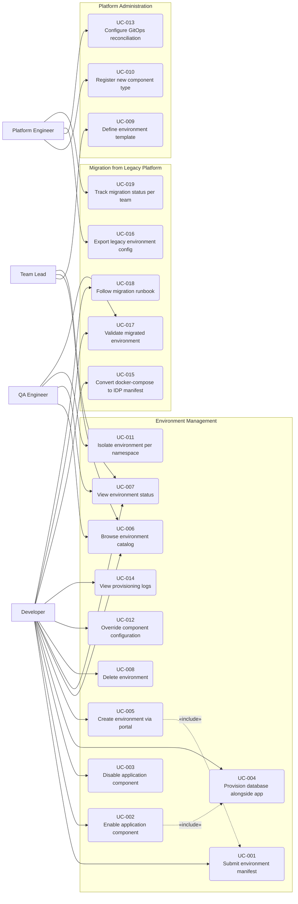

# Use Cases Overview — IDP Test Environment Platform

**Source:** [use_cases.puml](use_cases.puml) | **Requirements:** [requirements.md](requirements.md)

---

---

## Traceability

| UC      | Title                               | FR      |
|---------|-------------------------------------|---------|
| UC-001  | Submit environment manifest         | FR-001  |
| UC-002  | Enable application component        | FR-002  |
| UC-003  | Disable application component       | FR-003  |
| UC-004  | Provision database alongside app    | FR-004  |
| UC-005  | Create environment via portal       | FR-005  |
| UC-006  | Browse environment catalog          | FR-006  |
| UC-007  | View environment status             | FR-007  |
| UC-008  | Delete environment                  | FR-008  |
| UC-009  | Define environment template         | FR-009  |
| UC-010  | Register new component type         | FR-010  |
| UC-011  | Isolate environment per namespace   | FR-011  |
| UC-012  | Override component configuration    | FR-012  |
| UC-013  | Configure GitOps reconciliation     | FR-013  |
| UC-014  | View provisioning logs              | FR-014  |
| UC-015  | Convert docker-compose to IDP manifest | FR-015 |
| UC-016  | Export legacy environment config    | FR-016  |
| UC-017  | Validate migrated environment       | FR-017  |
| UC-018  | Follow migration runbook            | FR-018  |
| UC-019  | Track migration status per team     | FR-019  |
